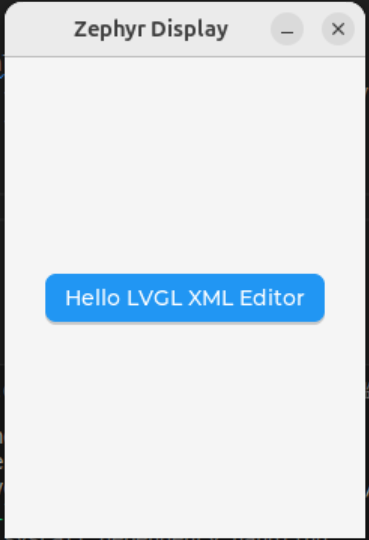
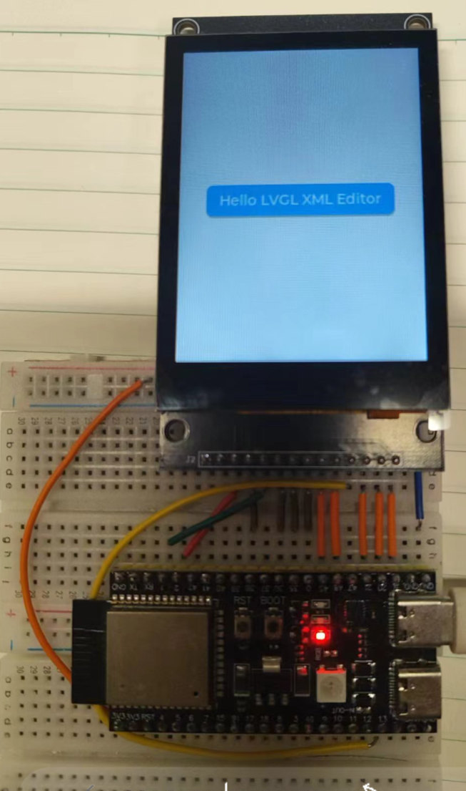

# How to Use LVGLXMLwZephyr to Export LVGL XML and Run It in Zephyr [中文](README.zh.md)

This is a **Zephyr + [LVGL Pro](https://pro.lvgl.io/)** project example. The project provides a streamlined workflow for integrating LVGL Pro and Zephyr applications.
Within the Zephyr App, the integrated `west` command allows you to export the C code generated from LVGL Pro XML files directly into this project. With just **three lines of code modification**, you can run the LVGL code produced by LVGL Pro within Zephyr.

**Note:** Currently, the LVGL version integrated in the Zephyr project is **9.3.0**, while the LVGL code exported from **LVGL Pro XML Editor** is based on **9.4.0**.
Therefore, the LVGL code exported by the LVGL Pro XML Editor may **not work completely** at this time. It will be fully compatible once the LVGL version integrated in the Zephyr project is upgraded to **9.4.0**.

## Usage

All operations are performed under a **Linux system**.

Assume you have already installed the Zephyr development environment, including the `west` command.
If not, please refer to: [https://docs.zephyrproject.org/latest/develop/getting_started/index.html](https://docs.zephyrproject.org/latest/develop/getting_started/index.html)

Assume you have also installed the **LVGL Pro XML Editor**.
If not, please refer to: [https://docs.lvgl.io/master/details/xml/editor/install.html](https://docs.lvgl.io/master/details/xml/editor/install.html)

### Step 1: Download the Zephyr Project

```bash
mkdir ~/lzp
cd ~/lzp
git clone https://github.com/frank-zpro/LVGLXMLwZephyr.git
west init -m ./LVGLXMLwZephyr
west update
```

### Step 2: Download the LVGL XML Project and Generate C Code

```bash
cd ~/lzp
git clone https://github.com/lgl88911/ePTest.git
```

1. Launch `LVGL_Pro_Editor-1.0.0-rc2.AppImage`
2. Go to **Project → Open UI Project**, and open `ePTest`
3. Go to **Project → Build UI Project**

### Step 3: Import and Run

```bash
cd ~/lzp
west lvglxml ./ePTest/
west build -b native_sim ./LVGLXMLwZephyr/app
west build -t run
```

You will see:



This project also provides an example based on real **ESP32-S3** hardware:

```bash
west build -b esp32s3_touch_lcd_2/esp32s3/procpu LVGLXMLwZephyr/app/
west flash
```

You will see:


## How to Modify Your Own LVGL XML Project

If your LVGL XML project name is not `ePTest`, you will need to modify the file `LVGLXMLwZephyr/app/src/main.c`.

For example, if your project is named `MyProject`, and your main screen is named `MyScreen`, modify `LVGLXMLwZephyr/app/src/main.c` as follows:

* Replace `#include "ePTest.h"` with `#include "MyProject.h"`
* Replace `ePTest_init(NULL);` with `MyProject_init(NULL);`
* Replace `lv_screen_load(main_screen);` with `lv_screen_load(MyScreen);`
