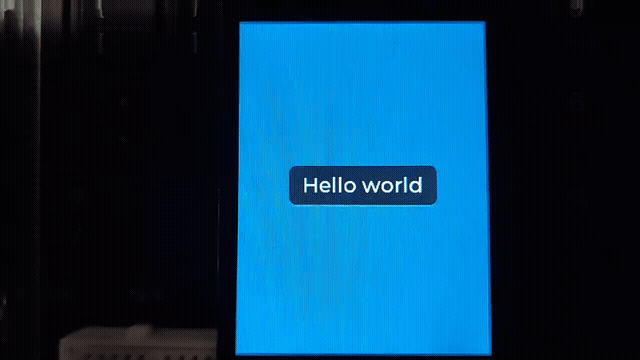
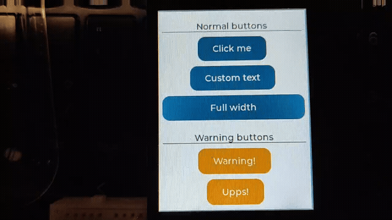

## Tutorials ([中文](tutorials.zh.md))

These are example projects from the LVGL Editor GitHub repository:
[https://github.com/lvgl/lvgl_editor/tree/master/examples](https://github.com/lvgl/lvgl_editor/tree/master/examples)

The official LVGL tutorial examples require a file system to work, so only real-device demonstrations on **ESP32-S3** are provided here.

### Usage

#### 1. Switch to the `lvgl_examples` branch

```bash
cd ~/lzp/LVGLXMLwZephyr
git checkout tutorials
cd ~/lzp/ePTest
git checkout tutorials
cd ~/lzp
west update
```

#### 2. Export code from XML

* Launch `LVGL_Pro_Editor-1.0.1.AppImage`
* Select **Project → Open UI Project**, and open `ePTest/<demo>`
* Select **Project → Build UI Project**
* Run the following commands:

```bash
cd ~/lzp
west lvglxml ./ePTest/<demo>
```

Here, `<demo>` refers to one of the example projects under the `ePTest` directory, for example:
`ePTest/1_hello_world`

#### 3. Modify `~/lzp/LVGLXMLwZephyr/app/src/main.c`

Enable the corresponding macro `CONFIG_LVGL_XML_<demo>_SUPPORT` and disable the other macros.
For example:

```c
#define CONFIG_LVGL_XML_HELLO_WORLD_SUPPORT 1
```

**Mapping between macros and demos**

| Demo folder name | Macro                                 |
| ---------------- | ------------------------------------- |
| 1_hello_world    | CONFIG_LVGL_XML_HELLO_WORLD_SUPPORT   |
| 2_new_component  | CONFIG_LVGL_XML_NEW_COMPONENT_SUPPORT |
| 3_assets         | CONFIG_LVGL_XML_ASSETS_SUPPORT        |
| 4_screens        | CONFIG_LVGL_XML_GAUGES_SUPPORT        |
| 5_layouts        | CONFIG_LVGL_XML_LAYOUTS_SUPPORT       |
| 6_data_binding   | CONFIG_LVGL_XML_DATA_BINDING_SUPPORT  |
| 7_translations   | CONFIG_LVGL_XML_TRANSLATIONS_SUPPORT  |
| 8_animations     | CONFIG_LVGL_XML_ANIMATIONS_SUPPORT    |

#### 4. Build and flash the code

```bash
west build -b esp32s3_touch_lcd_2/esp32s3/procpu LVGLXMLwZephyr/app/
west flash
```

### What you will see

**1_hello_world example**



**2_new_component example**



**3_assets example**


**4_screens example**


**5_layouts example**


**6_data_binding example**


**7_translations example**


**8_animations example**


